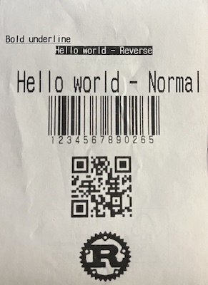
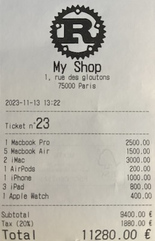

# ESC/POS Rust implementation

[](https://github.com/fabienbellanger/escpos-rs/actions/workflows/CI.yml)
[](https://crates.io/crates/escpos)
[](https://docs.rs/escpos)

This crate implements a subset of Epson's ESC/POS protocol for thermal receipt printers.
It allows you to generate and print documents with basic text formatting, cutting, barcodes, QR codes and raster images
on a compatible printer. It also provides a way to check the printer status.

   
_Printed on Aures ODP 333_

This project is strongly inspired by [recibo](https://github.com/jamhall/recibo/tree/main) _(Rust)_,
[escposify](https://github.com/local-group/rust-escposify) _(Rust)_
and [escpos](https://github.com/hennedo/escpos) _(Go)_.

## Installation

For standard functionalities (e.g. printing text), no additional dependencies are required:

```toml
[dependencies]
escpos = "0.15.1"
```

If you need all [features](#Features-list), you can use the `full` feature:

```toml
[dependencies]
escpos = { version = "0.15.1", features = ["full"] }
```

Or you can use `cargo add` command:

```bash
cargo add escpos
cargo add escpos -F full
```

## Code coverage

Tool used: [tarpaulin](https://github.com/xd009642/tarpaulin)

```shell
cargo install cargo-tarpaulin
```

```shell
cargo tarpaulin --all-features --tests

```

_Results:_

- [2025-01-16] `59.37% coverage, 1217/2050 lines covered`

## MSRV

Tool used: [cargo-msrv](https://github.com/foresterre/cargo-msrv)

```shell
cargo install cargo-msrv
```

```shell
cargo msrv find
cargo msrv verify
```

## Features list

| Name          | Description                                                            | Default |
| ------------- | ---------------------------------------------------------------------- | :-----: |
| `barcodes`    | Print barcodes (UPC-A, UPC-E, EAN8, EAN13, CODE39, ITF or CODABAR)     |   ✅    |
| `codes_2d`    | Print 2D codes (QR Code, PDF417, GS1 DataBar, DataMatrix, Aztec, etc.) |   ✅    |
| `graphics`    | Print raster images                                                    |   ❌    |
| `usb`         | Enable USB feature                                                     |   ❌    |
| `native_usb`  | Enable native USB feature                                              |   ❌    |
| `hidapi`      | Enable HidApi feature                                                  |   ❌    |
| `serial_port` | Enable Serial port feature                                             |   ❌    |
| `ui`          | Enable ui feature (UI components)                                      |   ❌    |
| `full`        | Enable all features                                                    |   ❌    |

## Examples

The `examples` folder contains various examples of how to use `escpos`.  
The [docs](https://docs.rs/escpos) also provide code snippets and examples.

To launch an example, use the following command:

```shell
RUST_LOG=debug cargo run --example full --features full
```

The list of all the examples can be found [here](examples/EXAMPLES.md).

### Simple text formatting

```rust
use escpos::printer::Printer;
use escpos::printer_options::PrinterOptions;
use escpos::utils::*;
use escpos::{driver::*, errors::Result};

fn main() -> Result<()> {
    env_logger::init();

    let driver = NetworkDriver::open("192.168.1.248", 9100, None)?;
    Printer::new(driver, Protocol::default(), Some(PrinterOptions::default()))
        .debug_mode(Some(DebugMode::Dec))
        .init()?
        .smoothing(true)?
        .bold(true)?
        .underline(UnderlineMode::Single)?
        .writeln("Bold underline")?
        .justify(JustifyMode::CENTER)?
        .reverse(true)?
        .bold(false)?
        .writeln("Hello world - Reverse")?
        .feed()?
        .justify(JustifyMode::RIGHT)?
        .reverse(false)?
        .underline(UnderlineMode::None)?
        .size(2, 3)?
        .writeln("Hello world - Normal")?
        .print_cut()?;

    Ok(())
}
```

### EAN13

```rust
use escpos::printer::Printer;
use escpos::utils::*;
use escpos::{driver::*, errors::Result};

fn main() -> Result<()> {
    env_logger::init();

    let driver = ConsoleDriver::open(true);
    Printer::new(driver, Protocol::default(), None)
        .debug_mode(Some(DebugMode::Hex))
        .init()?
        .ean13_option(
            "1234567890265",
            BarcodeOption::new(
                BarcodeWidth::M,
                BarcodeHeight::S,
                BarcodeFont::A,
                BarcodePosition::Below,
            )
        )?
        .feed()?
        .print_cut()?;

    Ok(())
}
```

### QR Code

```rust
use escpos::printer::Printer;
use escpos::utils::*;
use escpos::{driver::*, errors::Result};

fn main() -> Result<()> {
    env_logger::init();

    let driver = ConsoleDriver::open(true);
    Printer::new(driver, Protocol::default(), None)
        .debug_mode(Some(DebugMode::Hex))
        .init()?
        .qrcode_option(
            "https://www.google.com",
            QRCodeOption::new(QRCodeModel::Model1, 6, QRCodeCorrectionLevel::M),
        )?
        .feed()?
        .print_cut()?;

    Ok(())
}
```

### Bit image (with `graphics` feature enabled)

```rust
use escpos::printer::Printer;
use escpos::utils::*;
use escpos::{driver::*, errors::Result};

fn main() -> Result<()> {
    env_logger::init();

    let driver = ConsoleDriver::open(true);
    let mut printer = Printer::new(driver, Protocol::default(), None);
    printer.debug_mode(Some(DebugMode::Hex))
        .init()?
        .bit_image_option(
            "./resources/images/rust-logo-small.png",
            BitImageOption::new(Some(128), None, BitImageSize::Normal)?,
        )?
        .feed()?
        .print_cut()?;

    Ok(())
}
```

### Check printer status

```rust
use escpos::printer::Printer;
use escpos::utils::*;
use escpos::{driver::*, errors::Result};

fn main() -> Result<()> {
    env_logger::init();

    let driver = ConsoleDriver::open(true);
    Printer::new(driver.clone(), Protocol::default(), None)
        .debug_mode(Some(DebugMode::Dec))
        .real_time_status(RealTimeStatusRequest::Printer)?
        .real_time_status(RealTimeStatusRequest::RollPaperSensor)?
        .send_status()?;

    let mut buf = [0; 1];
    driver.read(&mut buf)?;

    let status = RealTimeStatusResponse::parse(RealTimeStatusRequest::Printer, buf[0])?;
    println!(
        "Printer online: {}",
        status.get(&RealTimeStatusResponse::Online).unwrap_or(&false)
    );

    Ok(())
}
```

## Commands list

| Status | Command                         | Description                                           | Feature    |
| :----: | ------------------------------- | ----------------------------------------------------- | ---------- |
|   ✅   | `init()`                        | Initialize printer (`ESC @`)                          |            |
|   ✅   | `print()`                       | Print document                                        |            |
|   ✅   | `reset()`                       | Hardware reset (`ESC ? LF 0`)                         |            |
|   ✅   | `cut()`                         | Paper cut (`GS V A 0`)                                |            |
|   ✅   | `partial_cut()`                 | Partial paper cut (`GS V A 1`)                        |            |
|   ✅   | `print_cut()`                   | Print and paper cut                                   |            |
|   ✅   | `page_code()`                   | Select character code table (`ESC t`)                 |            |
|   ✅   | `character_set()`               | Select an international character set (`ESC R`)       |            |
|   ✅   | `bold()`                        | Text bold (`ESC E`)                                   |            |
|   ✅   | `underline()`                   | Text underline (`ESC -`)                              |            |
|   ✅   | `double_strike()`               | Text double strike (`ESC G`)                          |            |
|   ✅   | `font()`                        | Text font (`ESC M`)                                   |            |
|   ✅   | `flip()`                        | Text flip (`ESC V`)                                   |            |
|   ✅   | `justify()`                     | Text justify (`ESC a`)                                |            |
|   ✅   | `reserve()`                     | Text reserve color (`GS B`)                           |            |
|   ✅   | `size()`                        | Text size (`GS !`)                                    |            |
|   ✅   | `reset_size()`                  | Reset text size (`GS !`)                              |            |
|   ✅   | `smoothing()`                   | Smoothing mode (`GS b`)                               |            |
|   ✅   | `feed()`                        | Line feed (`ESC d`)                                   |            |
|   ✅   | `feeds()`                       | Multiple lines feed (`ESC d`)                         |            |
|   ✅   | `line_spacing()`                | Line spacing (`ESC 3`)                                |            |
|   ✅   | `reset_line_spacing()`          | Reset line spacing (`ESC 2`)                          |            |
|   ✅   | `upside_down()`                 | Upside-down mode (`ESC {`)                            |            |
|   ✅   | `cash_drawer()`                 | Generate pulse (`ESC p`)                              |            |
|   ✅   | `write()`                       | Write text                                            |            |
|   ✅   | `writeln()`                     | Write text and line feed                              |            |
|   ✅   | `custom()`                      | Custom command                                        |            |
|   ✅   | `custom_with_page_code()`       | Custom command with page code                         |            |
|   ✅   | `motion_units()`                | Set horizontal and vertical motion units (`GS P`)     |            |
|   ✅   | `ean13()`                       | Print EAN13 with default option                       | `barcode`  |
|   ✅   | `ean13_option()`                | Print EAN13 with custom option                        | `barcode`  |
|   ✅   | `ean8()`                        | Print EAN8 with default option                        | `barcode`  |
|   ✅   | `ean8_option()`                 | Print EAN8 with custom option                         | `barcode`  |
|   ✅   | `upca()`                        | Print UPC-A with default option                       | `barcode`  |
|   ✅   | `upca_option()`                 | Print UPC-A with custom option                        | `barcode`  |
|   ✅   | `upce()`                        | Print UPC-E with default option                       | `barcode`  |
|   ✅   | `upce_option()`                 | Print UPC-E with custom option                        | `barcode`  |
|   ✅   | `code39()`                      | Print CODE 39 with default option                     | `barcode`  |
|   ✅   | `code39_option()`               | Print CODE 39 with custom option                      | `barcode`  |
|   ✅   | `codabar()`                     | Print CODABAR with default option                     | `barcode`  |
|   ✅   | `codabar_option()`              | Print CODABAR with custom option                      | `barcode`  |
|   ✅   | `itf()`                         | Print ITF with default option                         | `barcode`  |
|   ✅   | `itf_option()`                  | Print ITF with custom option                          | `barcode`  |
|   ✅   | `qrcode()`                      | Print QR code with default option                     | `codes_2d` |
|   ✅   | `qrcode_option()`               | Print QR code with custom option                      | `codes_2d` |
|   ✅   | `bit_image()`                   | Print raster bit image with default option            | `graphics` |
|   ✅   | `bit_image_option()`            | Print raster bit image with custom option             | `graphics` |
|   ✅   | `bit_image_from_bytes()`        | Print raster bit image from bytes with default option | `graphics` |
|   ✅   | `bit_image_from_bytes_option()` | Print raster bit image from bytes with custom option  | `graphics` |
|   ✅   | `gs1_databar_2d`                | Print 2D GS1 DataBar with default option              | `codes_2d` |
|   ✅   | `gs1_databar_2d_option`         | Print 2D GS1 DataBar with custom option               | `codes_2d` |
|   ✅   | `pdf417`                        | Print PDF417 with default option                      | `codes_2d` |
|   ✅   | `pdf417_option`                 | Print PDF417 with custom option                       | `codes_2d` |
|   ✅   | `maxi_code`                     | Print MaxiCode with default option                    | `codes_2d` |
|   ✅   | `maxi_code_option`              | Print MaxiCode with custom option                     | `codes_2d` |
|   ✅   | `data_matrix`                   | Print DataMatrix with default option                  | `codes_2d` |
|   ✅   | `data_matrix_option`            | Print DataMatrix with custom option                   | `codes_2d` |
|   ✅   | `aztec`                         | Print Aztec code with default option                  | `codes_2d` |
|   ✅   | `aztec_option`                  | Print Aztec code with custom option                   | `codes_2d` |
|   🚧   | `graphic()`                     | Print raster graphic with default option              | `graphics` |
|   🚧   | `graphic_option()`              | Print raster graphic with custom option               | `graphics` |
|   ✅   | `draw_line()`                   | Print a line                                          | `ui`       |

- ✅ Done
- 🚧 In progress
- ❌ To do

## Page codes list

| Code       | Implemented? |
| :--------- | :----------: |
| PC437      |      ✅      |
| Katakana   |      ✅      |
| PC850      |      ✅      |
| PC860      |      ✅      |
| PC863      |      ✅      |
| PC865      |      ✅      |
| Hiragana   |      ❌      |
| PC851      |      ✅      |
| PC853      |      ✅      |
| PC857      |      ✅      |
| PC737      |      ✅      |
| ISO8859_7  |      ✅      |
| WPC1252    |      ✅      |
| PC866      |      ✅      |
| PC852      |      ✅      |
| PC858      |      ✅      |
| PC720      |      ❌      |
| WPC775     |      ✅      |
| PC855      |      ✅      |
| PC861      |      ✅      |
| PC862      |      ✅      |
| PC864      |      ❌      |
| PC869      |      ✅      |
| ISO8859_2  |      ✅      |
| ISO8859_15 |      ✅      |
| PC1098     |      ❌      |
| PC1118     |      ✅      |
| PC1119     |      ✅      |
| PC1125     |      ✅      |
| WPC1250    |      ✅      |
| WPC1251    |      ✅      |
| WPC1253    |      ✅      |
| WPC1254    |      ✅      |
| WPC1255    |      ❌      |
| WPC1256    |      ❌      |
| WPC1257    |      ✅      |
| WPC1258    |      ❌      |
| KZ1048     |      ✅      |

## External resources

- [Epson documentation](https://download4.epson.biz/sec_pubs/pos/reference_en/escpos)
